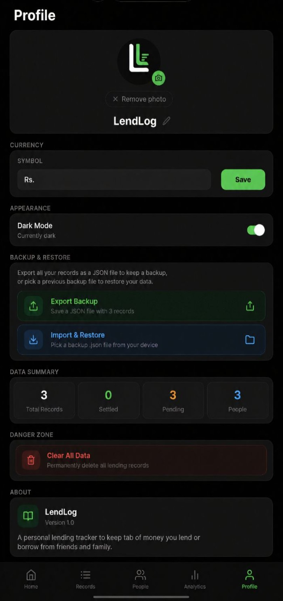

# LendLog

<div align="center">


# LendLog a Personal Lending Tracker

<p align="center">
  <b>A personal lending tracker to keep tab of money you lend or borrow from friends and family.</b>
</p>

<p align="center">
  <a href="https://mega.nz/file/YRMm3C4A#IcCMO4PgZmA_IavLVtfoXs99uE0MKyotSNo56OtWYek">
    
  </a>
</p>

</div>

A personal lending tracker for Android — built with Expo & React Native.

Track money you lend or borrow from friends and family. Log repayments, monitor balances, and back up your data — all offline, no account required.

---

## Screenshots

<table>
<tr>
<td></td>
<td></td>
<td></td>
</tr>
<tr>
<td align="center">Home</td>
<td align="center">Records</td>
<td align="center">People</td>
</tr>
</table>

<table>
<tr>
<td></td>
<td></td>
</tr>
<tr>
<td align="center">Analytics</td>
<td align="center">Profile</td>
</tr>
</table>

---

## Features

- Add lending and borrowing records with date, amount, and notes
- Log partial or full repayments against any open record
- Live balance calculation — total lent, total borrowed, net balance
- Analytics — monthly overview, top creditors, top debtors, settlement rate, overdue tracking (7 / 15 / 30 days)
- People tab — see who owes you and who you owe at a glance
- Search and filter records by name or note
- JSON backup export and restore (import from device)
- Profile photo and display name
- Dark and light theme
- Multi-currency support (INR, USD, EUR, GBP, and more)
- Fully offline — no login, no server, no account

---

## Stack

- [Expo](https://expo.dev) SDK 54 (React Native, New Architecture)
- [Expo Router](https://expo.github.io/router) v4 — file-based navigation
- [React Native Reanimated](https://docs.swmansion.com/react-native-reanimated/) — animations
- [React Native Gesture Handler](https://docs.swmansion.com/react-native-gesture-handler/)
- [@expo-google-fonts/inter](https://github.com/expo/google-fonts) — Inter font family
- [@expo/vector-icons](https://icons.expo.fyi) — icon set
- [expo-image-picker](https://docs.expo.dev/versions/latest/sdk/imagepicker/) — profile photo
- Local on-device storage (AsyncStorage / SQLite)

---

## Project Structure

```
app/
  (tabs)/
    _layout.tsx       # Bottom tab navigator
    index.tsx         # Dashboard / home
    records.tsx       # All lending records
    analytics.tsx     # Charts and stats
    people.tsx        # People view
    settings.tsx      # Settings and backup
    profile.tsx       # Profile screen
  +not-found.tsx
assets/
  images/
    icon.png
preview/              # Screenshots
```

---

## Getting Started

### Prerequisites

- Node.js 18+
- [Expo CLI](https://docs.expo.dev/get-started/installation/) (`npm install -g expo-cli`)
- Android device or emulator

### Install

```bash
git clone https://github.com/mrdevil42023/LendLog.git
cd LendLog
npm install
```

### Run (Expo Go)

```bash
npx expo start
```

Scan the QR code with the [Expo Go](https://expo.dev/client) app on your Android device.

### Build APK

```bash
# Local build (requires Android SDK)
npx expo run:android

# Cloud build via EAS
eas build -p android --profile preview
```

---

## Backup & Restore

Go to **Settings → Export Backup** to save a `.json` file of all your records to your device.

To restore, tap **Import & Restore** and pick the backup file. This will replace all current data.

---

## App Config

```json
{
  "name": "LendLog",
  "slug": "lendlog",
  "version": "1.0.1",
  "android": {
    "package": "com.lendlog.app"
  },
  "sdkVersion": "54.0.0"
}
```

---

## License

MIT

---

## Developer

# **KAILASH**  · [TELEGRAM](http://t.me/mrdevil12)
